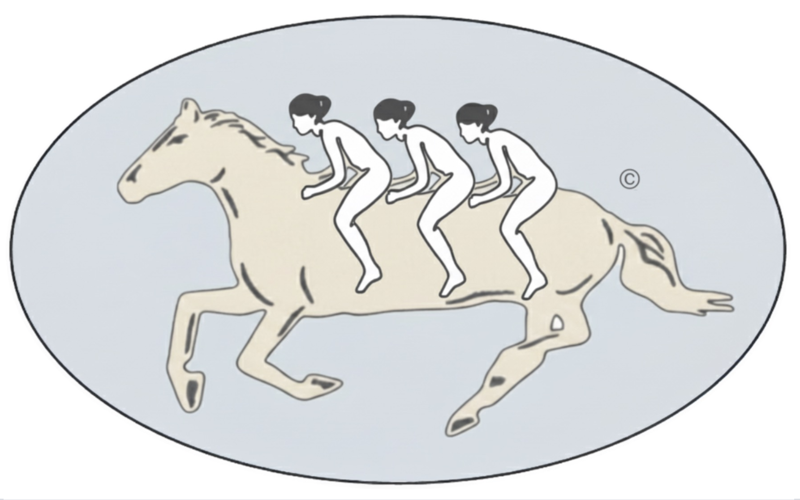

<p align="center">
  
</p>

# gallop

**Routes a product question to the method it deserves, then runs that method with the checks that stop it returning a confident wrong number.**

> **Being built in the open. Not ready to use yet.**
> One skill of six is in progress, the Python package is not published, and the
> install below does not work until the first release. The two documents worth
> reading today are [the method map](https://0trm.github.io/gallop/map/) and
> [the intake algorithm](https://0trm.github.io/gallop/intake/). Feedback on
> those is worth more right now than a star.

gallop is a product data science system, packaged as agent skills. A question
arrives; gallop routes it. One lookup against what the team already knows, three
questions, and one gate that asks whether the metric can be trusted at all. Most
questions leave without an analysis, and that is the point. The ones that stay
get the method that fits how treatment was assigned, sized from the effects this
metric has actually produced rather than from a number that would be nice, and
read out with the checks that separate a real result from a confident wrong one:
the sample ratio, the exposure log, the sequential bound, the shrinkage toward
the prior. What the answer teaches is written back before the ticket closes, so
the next question starts smaller.

## The map

A question enters at the left and leaves as a decision. Measurement is a
foundation rather than a phase, because what ships changes the data. Theory is a
ceiling rather than a report, because what you learn has to outlive the test that
produced it.

Three method buckets, a floor underneath them, a memory above them, and a layer
of judgment on top. Each bucket has its own question, its own output, and its own
failure mode:

| Bucket | Asks | Hands back | Fails by |
|---|---|---|---|
| Description | What happened? | A hypothesis | Being mistaken for causation |
| Causation | Did this change cause that? | An effect size | An invalid comparison group |
| Prediction | What will happen? Who gets what? | A forecast, a ranking, an allocation | Breaking the moment you intervene |

Experimentation and causal inference share all three, so they are one bucket
separated only by who did the randomising: you, or the world.

**[Read the full map](https://0trm.github.io/gallop/map/)** ·
**[Read the intake algorithm](https://0trm.github.io/gallop/intake/)**

## The six skills

| Skill | Position | What it decides |
|---|---|---|
| [`routing-questions`](skills/routing-questions/SKILL.md) | Routing | Whether this becomes work at all, and which of the other five it becomes |
| [`defining-metrics`](skills/defining-metrics/SKILL.md) | Floor | A metric turned into a computation, a source of truth, and a statement of how it will be gamed |
| [`designing-experiments`](skills/designing-experiments/SKILL.md) | Causation | The four choices that cannot be repaired after launch |
| [`reading-experiments`](skills/reading-experiments/SKILL.md) | Causation | Whether the result is a result |
| [`choosing-causal-designs`](skills/choosing-causal-designs/SKILL.md) | Causation | Which design fits, when assignment already happened |
| [`writing-readouts`](skills/writing-readouts/SKILL.md) | Ceiling | The belief, not just the number, and where it gets filed |

## Install

Not yet. When the first release lands:

```bash
/plugin marketplace add 0trm/gallop
/plugin install gallop@gallop
```

Skills are plain markdown, so any agent that reads instruction files can use one
directly:

```bash
cp -r gallop/skills/reading-experiments .claude/skills/
```

## What this is not

Not an experimentation platform. It does not assign traffic, hold flags, or
replace your warehouse. It assumes those exist and writes the part that decides
whether the number they produced is true.

## Licence

MIT, see [LICENSE](LICENSE). Asset provenance is recorded in [NOTICE](NOTICE).
